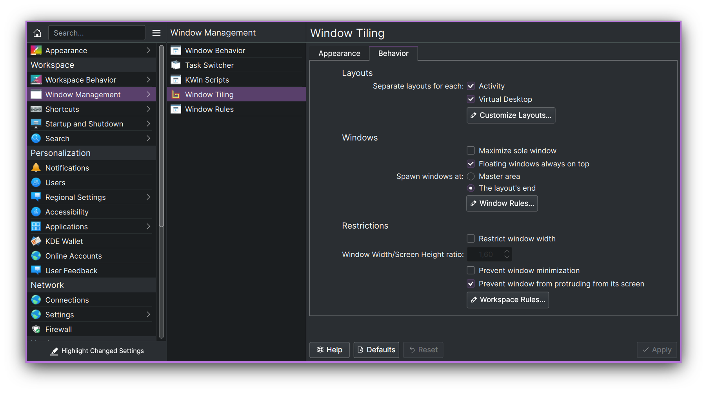

This is my personal experimental master feature-branch of [Bismuth-Forge/bismuth](https://github.com/Bismuth-Forge/bismuth).


This repo holds some patches that aren't clean enough yet to PR upstream but are perhaps useful enough to share anyway and I'm always grateful for usability feedback.

My end goal is to bring the best features of tiling-centric managers into a properly polished kwin experience consistent with kwin's heritage of being adaptable to a wide variety of workflows.

For the most part I'm just keeping the master branch in sync with what I'm daily-driving, though there are some branches with cherry-picked features/fixes that I hope are almost ready for upstream review into bismuth.

* **support changing "desktops" individually per monitor** (user feedback is desired before proposing API changes upstream to kwin)
* persistent layouts and window positions across kwin/bismuth restarts
* real-time layout adjustment while moving a window via mouse-drag
* new layout that supports tabbed/stacked windows in the master section

<<<<<<< HEAD
* additional options for placement of new spawned windows
* animation effect for moving windows (legitimately improves UX IMHO, giving a clue as to what went where instead of an instantaneous flash change)
* support moving focus/windows across monitor boundaries
* bugfixes related to window change events initiated by non-bismuth inputs (e.g. when the user has kwin move a window to a different screen/desktop/activity instead of using a bismuth keybind)
* new and unknown bugs, free of charge :)
=======
Arrange your windows in different grids to minimize the mouse usage.

## 🌟 Features 🌟

### Automatic window tiling

Save your time by automatically managing windows on your screen.

https://user-images.githubusercontent.com/14205339/148453685-f1bcfa46-4952-4b9d-a6f1-d2d75a0b4992.mp4

<br>

### Plasma integration

Power-up your workflow using native Plasma features - Virtual Desktops and
Activities.

https://user-images.githubusercontent.com/14205339/148562411-c9cca82a-c694-4794-b5e4-8fe716ec3d98.mp4

<br>

### Multiple Layouts

Use different layouts in different contexts.

https://user-images.githubusercontent.com/14205339/148564378-1def9350-a871-4f75-ba66-7a59ea1d4680.mp4

</div>

<br>
<br>
<br>

## 🏁 Getting Started

### Requirements

- A Linux distribution with KDE Plasma version 5.20 or higher
- Qt version 5.15 or higher
- KDE Frameworks version 5.78 or higher

You can check if your system matches these requirements by going to System
Settings > About this System.

### Installation

:warning: Distributions' packages are not affiliated with Bismuth developers.
If you encounter any issues with the incorrect installation, you should
contact the package maintainer first.

#### Arch Linux

- [AUR](https://aur.archlinux.org/packages/kwin-bismuth)

#### Debian

- [Volian Repository](https://volian.org/bismuth/)

#### Ubuntu

- [Official Repo](https://launchpad.net/ubuntu/+source/bismuth):

  ```bash
  sudo apt install kwin-bismuth
  ```

- [Volian Repository](https://volian.org/bismuth/)

#### Fedora

- [Official Repo](https://src.fedoraproject.org/rpms/bismuth):

  ```bash
  sudo dnf install bismuth
  ```

#### OpenSUSE Tumbleweed

- [home:rxmd OBS Repository](https://build.opensuse.org/package/show/home:rxmd/kwin-script-tiling-bismuth)

#### Gentoo

- [VipreML Overlay](https://github.com/viperML/viperML-overlay/)

#### Solus

- [Solus](https://dev.getsol.us/source/bismuth)

#### From Source

- [See Dev Docs](CONTRIBUTING.md)

If you know a packaging solution for a distribution, that is not in the
list, please open a pull request.

### Usage

🎉 To start using Bismuth enable it in System Settings > Window Management >
Window Tiling. Additionally, you can decorate your windows in a tiling window
manager style (border-only windows) using the window decoration, that comes
with Bismuth. To do so, go to System Settings > Appearance > Window Decorations
and select the Bismuth decoration.

⌨️ You can view the shortcuts in System Settings > Shortcuts > Window Tiling. If
you used Krohnkite before, you can import some of its shortcuts using [the bash
script](contrib/import_krohnkite.sh).

🔧 If you want, you may also make a couple of manual fixes and tweaks to
improve your experience with window tiling. See [Tweaks
section](docs/TWEAKS.md).

### Configuration

You can configure Bismuth in the System Settings > Window Management > Window Tiling.



## 🤝 Acknowledgments

This project was made possible because of the hard work of other people on [Krohnkite
KWin Tiling Script](https://github.com/esjeon/krohnkite).
>>>>>>> origin/master
